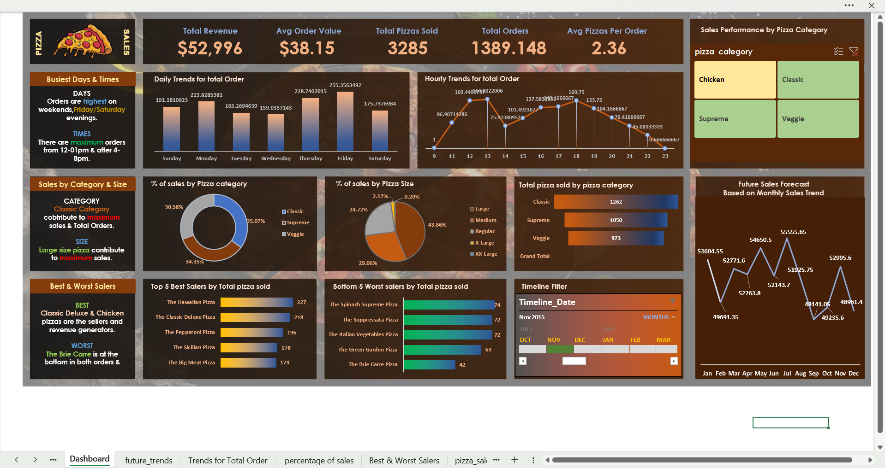

# 🍕 Pizza Sales Analysis Dashboard

## 📌 Project Overview
This project presents an interactive **Pizza Sales Analysis Dashboard** built using **MS Excel** with data sourced from **MySQL**. The dashboard helps analyze sales performance, customer ordering patterns, and category-wise trends to support data-driven decision making.

---

## 🎯 Objectives
- Analyze overall pizza sales performance
- Identify best-selling pizza categories and peak sales periods
- Track key performance indicators (KPIs)
- Forecast future sales trends using historical data

---

## 📊 Key Features
- **KPIs:** Total Revenue, Total Orders, Average Order Value  
- **Interactive Filters:** Pizza category slicer and timeline filter  
- **Category-wise Sales Analysis**  
- **Monthly Sales Trend & Future Sales Forecast**  
- Clean and user-friendly dashboard layout  

---

## 🛠️ Tools & Technologies
- **MS Excel:** Pivot Tables, Pivot Charts, Slicers, Timelines, Dashboards  
- **MySQL:** Data storage and query-based analysis  

---

## 📈 Insights Generated
- Identified top-performing pizza categories  
- Observed monthly sales trends and seasonality  
- Estimated future sales using trend-based forecasting  

---

## 🖼️ Dashboard Preview

